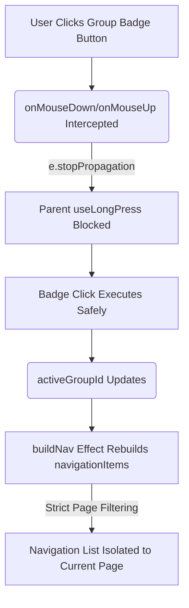

# Playlist Navigation & Explorer Page Isolation (June 16, 2026 Session)

This document provides a unified summary of the bugs resolved and the architectural enhancements implemented during the development session on June 16, 2026. The changes focus on strict isolation between **Explorer Pages**, correct behavior of the **Top Playlist Menu**, and preventing event collisions inside the player controller.

---

## 1. Core Problems Identified

### 1.1 Cross-Page Navigation Leak
- **Symptom**: When navigating sequentially on Explorer Page 1 using the playlist menu chevrons, the player would navigate to playlists residing on Page 2, Page 3, etc.
- **Cause**: The `useEffect` hook in `PlayerController.jsx` responsible for building navigation items (`buildNav`) only applied the page isolation filter if `activePage > 1`. As a result, Page 1 was not filtered at all, allowing the global library to leak in.

### 1.2 Cross-Page Carousel Selection (The "ALL" Badge Toggle)
- **Symptom**: Switching between Explorer Pages did not clear the selected group carousel (e.g., selecting the "Red" carousel on Page 1 remained active on Page 2). Furthermore, clicking the "ALL" badge on Page 2 to toggle to carousels would select the first group in the global array (which belonged to Page 1), causing cross-page jumps.
- **Cause**: The `activeGroupId` in `playlistGroupStore` was treated globally. Page-switching did not clear it, and the "ALL" toggle in `PlayerControllerPlaylistMenu.jsx` defaulted to the global `groups[0].id` instead of the first group on the active explorer page.

### 1.3 Out-of-Character Playlist Grid Opening (Click Propagation)
- **Symptom**: Clicking the active group badge text (`ALL` or the carousel name) on the player controller immediately opened the Playlists grid page.
- **Cause**: The parent wrapper container of the playlist menu uses the custom `useLongPress` hook, which intercepts mouse down/up and touch start/end events globally to open the grid page. Because the badge buttons did not stop the propagation of these specific mouse/touch lifecycle events, they bubbled up to the container, triggering the grid-opening action.

### 1.4 Random Playlist Jumps (Empty Carousel Cycling)
- **Symptom**: Cycling using the group badge arrows into carousels that did not have any playlists assigned would cause the player to select random playlists, sometimes on completely different explorer pages.
- **Cause**: Cycling into an empty carousel built an empty navigation list. When the list was empty, navigation index lookups failed and fell back to searching the global library, resulting in random jumps.

---

## 2. Implemented Resolutions

### 2.1 Zustand Store Scoping (`playlistGroupStore.js`)
- **Active Page Scoping**: Updated `setActivePage(p)` to check the page assignment of the current `activeGroupId`. If the group belongs to a different page than the newly selected page, `activeGroupId` is set to `null` (resetting the player controller to ALL mode for the new workspace).
- **Page Deletion Safety**: Updated `deletePage` to reset `activeGroupId` to `null` if the active group belonged to the deleted page.

### 2.2 Strict Page Filtering (`PlayerController.jsx`)
- **Unified Page Filtering**: Modified the `buildNav` effect to filter playlists for **Page 1** as well as secondary pages. On Page 1, it allows only playlists assigned to Page 1 groups + globally unsorted playlists (belonging to no groups).
- **Populated Groups Filtering**: Filtered `groupsOnPage` to exclude empty groups. The player controller now only recognizes groups that have at least one playlist assigned (`g.playlistIds && g.playlistIds.length > 0`).

### 2.3 Sub-Component Event Isolation (`PlayerControllerPlaylistMenu.jsx`)
- **Event Bubbling Blocked**: Added comprehensive event bubble interception to all group badge buttons and chevrons. They now swallow:
  - `onMouseDown` / `onMouseUp`
  - `onTouchStart` / `onTouchEnd`
  - `onClick`
  This completely prevents event leakage to the parent container's `useLongPress` hook.
- **Page-Scoped TOGGLE**: Updated the `ALL` badge click/touch handlers to select `groupsOnPage[0].id` (the first populated group on the current explorer page) instead of `groups[0].id` (global first group).

---

## 3. Summary of Event Flow

## 4. Verification & Testing
- The Vite compiler compiles the codebase successfully (`npm run build`).
- Sequential navigation (chevrons flanking the grid button) correctly stays within the boundary of the active explorer page.
- Empty carousels are automatically excluded from the menu badge and cycle list.
