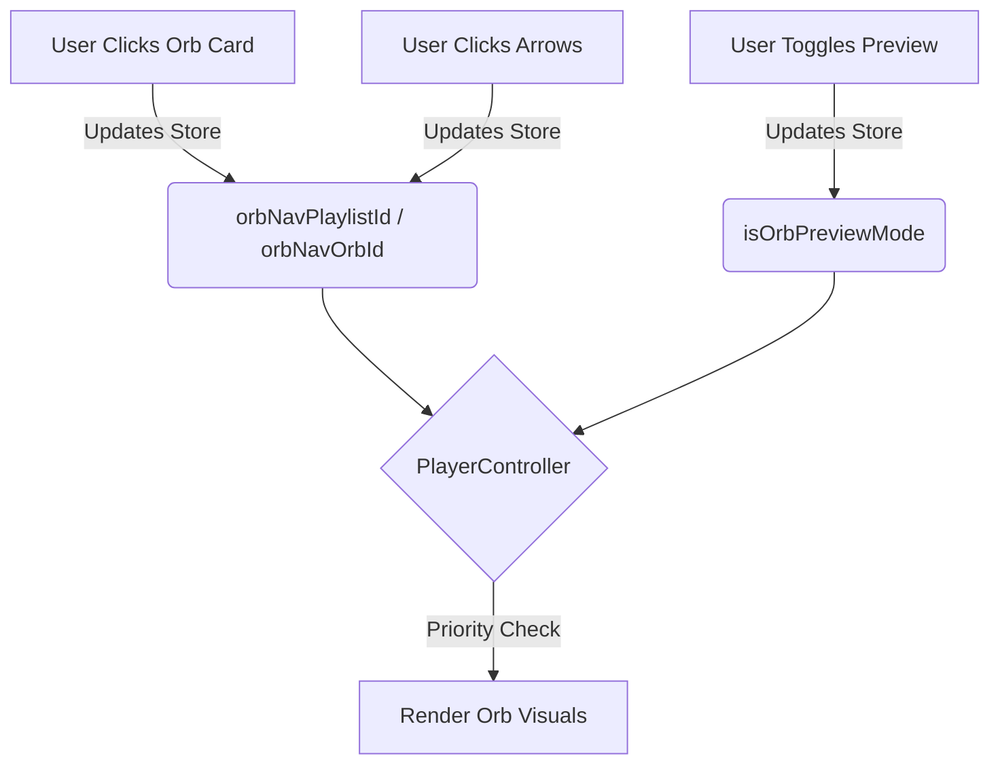

# Orb Navigation System

The Orb Navigation System provides a dedicated interface for browsing Orb configurations directly from the Player Controller, independent of the main video playback flow. This allows users to audition and select different visual styles (Orbs) without interrupting their current content.

## Overview

The system introduces a new navigation layer that operates in parallel to the main video playlist.

-   **Independent State**: Navigation happens within a specific "Orb Context" (`orbNavPlaylistId` and `orbNavOrbId`) stored in `configStore.js`.
-   **Live Preview**: Selecting an Orb instantly applies its visual settings (Image, Scale, Offsets, Spill, Masks) to the central player orb, overriding any default or playlist-based themes.
-   **Smart Filtering & "ALL" Mode**: By default, the navigator filters for playlists that contain Orbs. However, a dedicated **"ALL"** mode allows cycling through the entire library, treating every playlist as a potential theme source.
-   **Priority Selection Logic**: To prevent "playlist snapping" when playing a video that exists in multiple playlists, the system prioritizes the **currently navigated theme** as the source of truth for the playing context.

## User Interface

The controls are located on the main **Player Controller** (the central orb area). They appear on hover for a clean look.

### Controls

1.  **Playlist Navigation (Outer Arrows)**
    *   **Icon**: Double Chevron (`ChevronsLeft`, `ChevronsRight`)
    *   **Location**: Far left and far right of the orb.
    *   **Action**: Cycles through *Assignments-only* playlists. When a new playlist is selected, it automatically selects the first Orb in that playlist to give immediate feedback.

2.  **Orb Navigation (Inner Arrows)**
    *   **Icon**: Single Chevron (`ChevronLeft`, `ChevronRight`)
    *   **Location**: Closer to the orb, inside the playlist controls.
    *   **Action**: Cycles through the Orbs within the *currently selected navigation playlist*.

3.  **Direct Selection (Videos Page)**
    *   **Action**: Clicking any **Orb Card** in the main Videos grid will:
        1.  Apply that Orb's visual settings.
        2.  Update the **Orb Navigation State** to match that Orb's playlist and ID.
        3.  This ensures that if you start navigating with the arrows afterward, you continue from that specific Orb.

4.  **Live Preview Toggle (Configuration Page)**
    *   **Icon**: Eye Icon (`Eye`)
    *   **Location**: Top-right of the **Orb Config** page.
    *   **Action**: Forces the player to render the *current configuration being edited*, verifying exactly how it will look before saving.
    *   **Auto-Disable**: This mode automatically turns off when you leave the config page.

## Technical Implementation

### State Management (`configStore.js`)

The system relies on three key pieces of state in the global store:

```javascript
// Global Orb Navigation State
orbNavPlaylistId: null,      // The playlist currently being browsed for Orbs
setOrbNavPlaylistId: (val),

orbNavOrbId: null,           // The specific Orb currently selected
setOrbNavOrbId: (val),

isOrbPreviewMode: false,     // "Live Preview" toggle from the config page
setIsOrbPreviewMode: (val)
```

### Player Controller Logic (`PlayerController.jsx`)

The `getEffectiveOrbImage` function determines what to render based on priority:

1.  **Live Preview Mode**: (Highest Priority) If `isOrbPreviewMode` is true, render the raw configuration values from the store.
2.  **Navigation Override**: If `orbNavOrbId` is set, find that Orb in `orbFavorites` and render it.
3.  **Playlist/Group Theme**: (Default) If no override is active, fall back to the standard playlist theme or group leader logic.

### Data Flow



## Related Components

-   `src/components/PlayerController.jsx`: Main UI and logic.
-   `src/store/configStore.js`: State persistence.
-   `src/components/VideosPage.jsx`: Direct selection from grid.
-   `src/components/OrbCard.jsx`: Visual representation in grid.

## App Banner Navigation

The navigation system has been extended to support **App Banners**, allowing you to browse and select banner presets using the same arrow controls.

### Dual-Mode Navigation

To keep the interface clean, the player controller features a **Mode Toggle** button that switches the context of the arrow keys.

*   **Toggle Location**: Bottom-right of the Orb Menu (diagonal from the Twitter button).
*   **Orb Mode** (Default): Navigate through Orb Playlists and Orb Presets.
    *   **Icon**: Circle (`Circle`)
    *   **Indicator**: White border, dark icon.
*   **Banner Mode**: Navigate through Playlists with Banners and Banner Presets.
    *   **Icon**: Layout (`Layout`)
    *   **Indicator**: Sky blue border, blue icon.

### Banner Navigation Features

1.  **Unified Controls**: The same Outer/Inner arrows work for both modes.
    *   **Outer Arrows**: Switch between playlists that contain Banner Presets.
    *   **Inner Arrows**: Switch between Banner Presets within the current playlist.
2.  **Direct Selection**: Clicking a **Banner Preset Card** in the videos grid automatically:
    *   Applies the banner.
    *   Sets the navigation context to that playlist/banner.
    *   Allows seamless continuation of browsing via the arrows.
3.  **Live Editing Preview**:
    *   When editing a banner in `AppPage`, the system enters a **Banner Preview Mode**.
    *   This temporarily overrides any navigation-selected banner to strictly show what you are editing.
    *   Closing the editor automatically restores the previous navigation state.

### Technical Implementation

**State (`configStore.js`)**:
```javascript
activeNavigationMode: 'orb', // 'orb' | 'banner'
bannerNavPlaylistId: null,
bannerNavBannerId: null,
bannerPreviewMode: null // 'fullscreen' | 'splitscreen' | null
```

**Priority Logic (`LayoutShell.jsx`)**:
1.  **Preview Mode**: If `bannerPreviewMode` is active (from AppPage), show the draft config.
2.  **Navigation Override**: If `bannerNavBannerId` is set, show that preset.
3.  **Global Fallback**: Use `fullscreenBanner` / `splitscreenBanner` from general settings.
